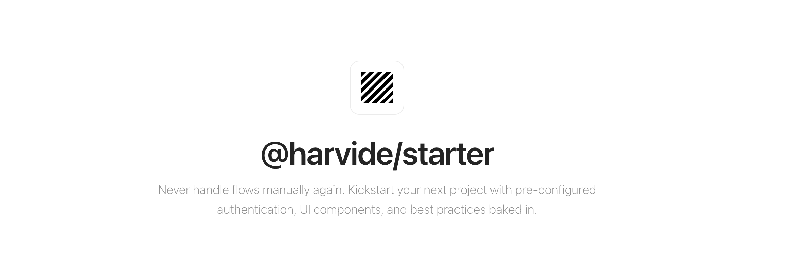

<br />
<p align="center">
    <a href="https://starter.harvide.com" target="_blank"></a>
    <br />
    <br />
    <b>@harvide/starter is a production-ready, highly customizable boilerplate for your next application. It provides a solid foundation with pre-configured authentication, UI components, and best practices baked in, allowing you to focus on what matters most: your product.</b>
    <br />
    <br />
</p>

[](https://starter.harvide.com/docs)
[](https://harvide.com)
[](https://discord.gg/jmm8PMCn9W)

## Key Features

-   **Authentication**: Robust, customizable user authentication.
-   **Mailing**: Integrated email notifications and templates.
-   **User Experience**: Beautiful, responsive UI components.
-   **Data Management**: Flexible database with Drizzle ORM.
-   **Admin Panel**: Powerful user management.
-   **Modern Stack**: Next.js, tRPC, Tailwind CSS.
-   **CLI Tooling**: Fast project setup and feature selection.

## Getting Started

Ready to kickstart your project?

1.  **Create a new project**:
    ```bash
    npx create-harvide-starter my-app
    ```

2.  **Navigate to your project and start the development server**:
    ```bash
    cd my-app
    npm run dev
    ```

For detailed installation steps and customization options, refer to our official documentation:

*   **[Documentation](https://starter.harvide.com/docs)**
*   **[Getting Started Guide](https://starter.harvide.com/docs/getting-started)**
*   **[Configuration Reference](https://starter.harvide.com/docs/configuration)**

## Configuration

Harvide Starter is designed for extensive customization primarily through a single configuration file: `starter.config.ts`, located at the root of your project.

For a complete overview of all configurable options, please see the [Configuration Reference](https://starter.harvide.com/docs/configuration) in our documentation.

## Contributing

We welcome contributions! Whether you're fixing a bug, implementing a new feature, or adding a new variant, your input is valuable. Please see our [Contributing Guide](CONTRIBUTING.md) for more details.

## License

Harvide Starter is available under the MIT license, making it free for both personal and commercial use. 
<!-- For additional features, enhanced support, and exclusive components, consider upgrading to [Starter Pro](https://starter.harvide.com/pro). -->

## Contributors
