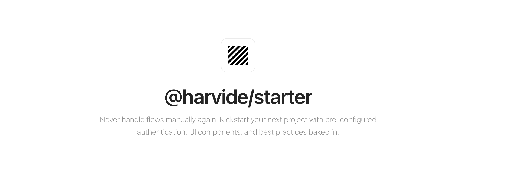

# Starter



**Never handle authentication flows, user management, or email notifications manually again.**

Starter is a production-ready, highly customizable boilerplate for your next application. It provides a solid foundation with pre-configured authentication, UI components, and best practices baked in, allowing you to focus on what matters most: your product.

## Key Features

-   **Comprehensive Authentication**: Supports email/password, phone, magic links, and social logins (Google, GitHub, etc.). Includes advanced features like multi-tenancy, multi-session management, 2FA, and OTP.
-   **Flexible Mailing System**: Send verification, password reset, and other notifications with customizable email templates and support for various providers.
-   **Rich User Experience**: Comes with reactive, beautiful UI components, smooth user flows, animations, and responsive design out of the box.
-   **Robust Data Layer**: Utilizes Drizzle ORM for flexible database access, supporting multiple databases and custom schema definitions.
-   **Powerful Admin Panel**: A fully functional admin interface to manage users, roles, and permissions, easily extensible to fit your needs.
-   **Modern Tech Stack**: Built with Next.js, tRPC for API calls, Tailwind CSS with Shadcn UI components, and Zod for schema validation.
-   **CLI for Quick Setup**: Get started in minutes with `npx create-harvide-starter`, which guides you through project setup and feature selection.

## Getting Started

Ready to kickstart your project?

1.  **Create a new project**:
    ```bash
    npx create-harvide-starter my-app
    ```
    Follow the prompts to configure your application, select features, and choose authentication methods.

2.  **Navigate to your project and start the development server**:
    ```bash
    cd my-app
    npm run dev
    ```

For detailed installation steps and customization options, refer to our official documentation:

*   **[Documentation](https://starter.harvide.com/docs)**
*   **[Getting Started Guide](/docs/getting-started)**
*   **[Configuration Reference](/docs/configuration)**

## Configuration

Harvide Starter is designed for extensive customization primarily through a single configuration file: `starter.config.ts`, located at the root of your project. This file allows you to define:

*   **Branding**: Application name, description, and logo for consistent identity across UI and emails.
*   **Authentication Behavior**: Enable/disable various authentication methods, set password policies, and manage account linking.
*   **UI Variants**: Choose different login and signup form implementations.
*   **Admin Panel Settings**: Configure impersonation, user banning, and dashboard metrics.
*   **Email Service**: Define email provider and sender details.

For a complete overview of all configurable options, please see the [Configuration Reference](/docs/configuration) in our documentation.

## License

Harvide Starter is available under the MIT license, making it free for both personal and commercial use. For additional features, enhanced support, and exclusive components, consider upgrading to [Starter Pro](https://starter.harvide.com/pro).

## Contributors
